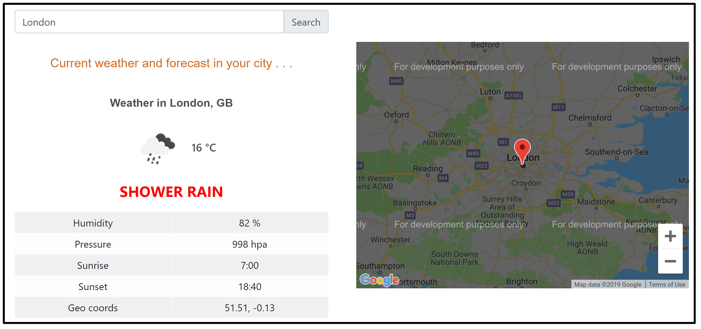

# Google map to display weather details.
This App allows to view the weather details of the current location, if the HTML's location finder is enabled upon opening this app, or else it allows user to find weather details by the name of the location. 
Also you can click a location on the google map and it displays the weather details of the selected location. 
This app uses 2 external APIs
* OpenWeatherMap 
* Google Map 

This project was generated with [Angular CLI](https://github.com/angular/angular-cli) version 8.3.6.

## Development server

Run `ng serve` for a dev server. Navigate to `http://localhost:4200/`. The app will automatically reload if you change any of the source files.

## Code scaffolding

Run `ng generate component component-name` to generate a new component. You can also use `ng generate directive|pipe|service|class|guard|interface|enum|module`.

Following external libraries have installed 
* bootstrap 
     npm -i --save bootstrap
* google map 
     npm i --save @agm/core
     
Also, make sure to update references for above installed libraries on the Angular.json

## Build

Run `ng build` to build the project. The build artifacts will be stored in the `dist/` directory. Use the `--prod` flag for a production build.

## Running unit tests

Run `ng test` to execute the unit tests via [Karma](https://karma-runner.github.io).

## Running end-to-end tests

Run `ng e2e` to execute the end-to-end tests via [Protractor](http://www.protractortest.org/).

## Further help

To get more help on the Angular CLI use `ng help` or go check out the [Angular CLI README](https://github.com/angular/angular-cli/blob/master/README.md).
